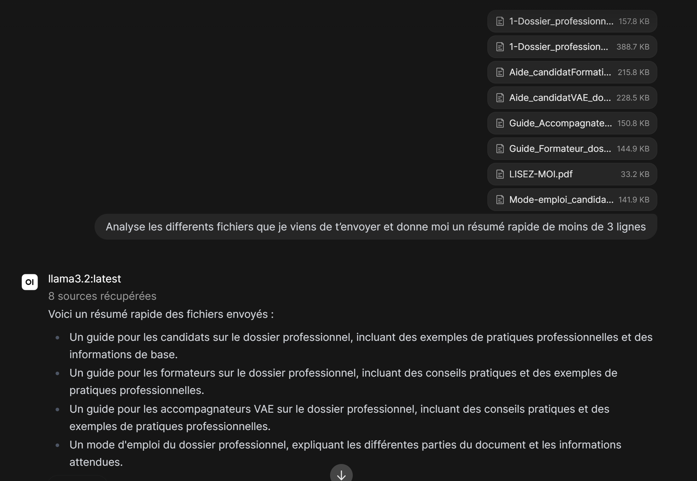

# Questions et réponses

**Expliciter la procédure pas à pas pour installer un WebGUI sur votre LLM local**
On utiliseras souvent **Open WebUI** , si on prends Ollama comme exemple si il est installé et fonctionnel. 
1. On installeras ensuite Docker via la commande ```curl -fsSL https://get.docker.com | sh``` dans le terminal.

2. On lance OpenWebUI en conteneur via :
``` docker run -d -p 3000:8080 \
     --add-host=host.docker.internal:host-gateway \
     -v open-webui:/app/backend/data \
     --name open-webui \
     --restart always \
     ghcr.io/open-webui/open-webui:main```
```

1. Accéder à l'interface : ouvrir ```http://<IP_de_la_machine>:3000``` depuis un navigateur.

2. Créer un compte administrateur local (le premier compte créé devient automatiquement admin).

3. Dans les paramètres, vérifier que l'URL d'Ollama pointe bien vers ```http://host.docker.internal:11434``` (ou l'IP de la machine hôte).

4. Sélectionner votre modèle local dans le menu déroulant et commencer à discuter.

**Peut on modifier le contexte d'un LLM local et si oui comment?**
Oui il est possible de modifier le contexte d'une IA, notamment directement via le prompt lorsque l'on communique avec elle. Différents paramètres modifiables par exemple sont : PARAMETER temperature 0.7      # créativité (0 = déterministe, 1+ = créatif) PARAMETER top_p 0.9            # diversité du vocabulaire PARAMETER num_predict 2048     # longueur max de la réponse générée PARAMETER repeat_penalty 1.1   # évite les répétitions

**Comment faire ingérer à votre LLM local le contenu d'un dossier avec quelques PDF?**
Il est possible de fournir un dossier avec plusieurs fichiers à une IA, en l'occurence ici nous lui avons fournis plusieurs PDF, qu'il a su lire et résumé en quelques lignes :


**Comment modifier le comportement général de notre LLM Local à l'aide d'un fichier ?**
Oui il est possible de créer un "Modelfile", qui se résume à une sorte de fichier de configuration, dans lequel nous allons mettre des paramètres précis pour nos réponses souhaitées par l'IA. Ensuite, nous allons indiquer au modèle de s'appuyer sur ce fichier de "configuration" pour les réponses futures

**Prouver que votre LLM local à pu ingérer correctement les données de fichiers PDF**
Voir réponse 3.

**Comment forcer votre LLM local à aller chercher ce qu'il ne sait pas sur Internet, est-ce possible? et si oui comment?**
Notre LLM locale n'a pas accès à la recherche web, il tire ses réponses de ses connaissances web qui datent de fin 2023. Si l'on veux des réponses plus récentes, il faut activer la recherche web dans les paramètres WebGui par exemple, en indiquant une clé API d'un des moteurs de recherche. A noter que cela sera payant dans la plupart des cas.


# Lexique IA

- **Inférence** : 
  - phase où un modèle déjà entraîné produit une réponse à partir d'une entrée.
- **RAG (Retrieval-Augmented Generation)** : 
  - technique qui enrichit une réponse du LLM en allant chercher des informations externes pertinentes avant de générer le texte.
- **ChatBot** : 
  - programme conversationnel simulant un dialogue avec un humain.
- **Paramètre** : 
  - valeur interne ajustée pendant l'entraînement d'un modèle (poids d'un réseau de neurones).
- **DataSet** : 
  - ensemble de données utilisé pour entraîner ou évaluer un modèle.
- **Agent IA** : 
  - système autonome capable de raisonner, planifier et utiliser des outils pour accomplir une tâche.
- **Modèle** : 
  - représentation mathématique entraînée sur des données pour effectuer une tâche.
- **Réseau de Neurones** : 
  - architecture de calcul inspirée du cerveau, composée de couches de neurones artificiels interconnectés.
- **Machine Learning** : 
  - discipline de l'IA où les systèmes apprennent des motifs à partir de données plutôt que d'être programmés explicitement.
- **NLP (Natural Language Processing)** : 
  - traitement automatique du langage naturel par une machine.
- **Qwen** : 
  - famille de modèles de langage open-source développée par Alibaba.
- **Deep Learning** : 
  - sous-domaine du Machine Learning basé sur des réseaux de neurones profonds (à plusieurs couches).
- **GPT (Generative Pre-trained Transformer)** : 
  - architecture de modèle de langage génératif développée par OpenAI.
- **IA Adpatative** : 
  - IA capable d'ajuster son comportement en fonction de nouvelles données ou de l'environnement.
- **IA Générale (AGI)** : 
  - intelligence artificielle hypothétique capable d'égaler ou dépasser l'humain sur toute tâche cognitive.
- **Ollama** : 
  - outil permettant d'exécuter et gérer des LLM en local facilement.
- **IA Générative** : 
  - IA capable de créer du contenu nouveau (texte, image, son) plutôt que de simplement classifier ou prédire.
- **Singularité Technologique** : 
  - hypothèse d'un point où l'IA dépasserait l'intelligence humaine, provoquant une accélération incontrôlable du progrès.
- **LLM (Large Language Model)** : 
  - modèle de langage de grande taille entraîné sur d'énormes corpus de texte.
- **Hallucination** : 
  - réponse générée par un modèle qui est fausse ou inventée mais présentée comme factuelle.
- **Embedding** : 
  - représentation vectorielle numérique d'un mot, d'une phrase ou d'un document, capturant son sens.
- **Token** : 
  - unité de texte (mot, sous-mot ou caractère) utilisée par un LLM pour traiter le langage.
- **European AI Act** : 
  - règlement européen encadrant l'usage et les risques liés à l'intelligence artificielle.
- **Prompt** : 
  - instruction ou question donnée à un modèle pour obtenir une réponse.
- **Algorithme** : 
  - suite finie et non ambiguë d'instructions permettant de résoudre un problème.
- **Test de Turing** : 
  - test évaluant si une machine peut imiter une conversation humaine de façon indiscernable.
- **Big Data** : 
  - ensembles de données massifs et complexes nécessitant des outils spécifiques pour être traités.
- **Biais** : 
  - distorsion systématique dans les résultats d'un modèle, souvent héritée des données d'entraînement.
- **ModelFile** : 
  - fichier de configuration Ollama définissant un modèle personnalisé (base, prompt système, paramètres).
- **SystemPrompt** : 
  - instruction initiale définissant le rôle, le ton ou les règles de comportement d'un LLM.
- **Deep Learning** : 
  - Sous-domaine du Machine Learning basé sur des réseaux de neurones profonds (à plusieurs couches), permettant de traiter des données complexes comme le texte, l'image ou le son.**
- **Données** : 
  - informations brutes (texte, image, nombre...) utilisées pour entraîner ou interroger un modèle.

## BONUS ##

- **Fine-Tuning**
  - ré-entraînement partiel d'un modèle pré-entraîné sur des données spécifiques pour spécialiser son comportement.
- **Quantization**
  - réduction de la précision numérique des poids d'un modèle pour le rendre plus léger et rapide (ex : modèles Ollama en Q4, Q8).
- **VRAM**
  - mémoire graphique de la carte vidéo, ressource critique pour exécuter des LLM localement.
- **Prompt Engineering**
  - art de formuler des prompts pour optimiser la qualité des réponses d'un LLM.

